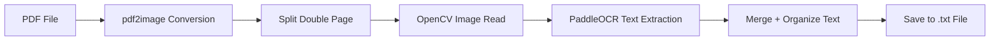

# 🖼️ OCR Extraction Pipeline for Exhibition Catalogues

This project contains a Python script that uses **PaddleOCR** to extract text from scanned 19th-century Dutch exhibition catalogues. The goal is to convert PDF pages into clean, readable `.txt` files, which can later be structured into Excel or database-ready formats.

---

## 🚀 How It Works

**Input:** Scanned PDF of a catalogue (often a double-page spread)  
**Output:** `.txt` file containing extracted raw text (ordered by left/right pages)

---

## 🧩 Process Overview



---

## 📁 Repository Structure

```
/paddle_ocr_extractor.py      # Main script to run PaddleOCR on PDFs
/pdf_pages/                   # Folder where page images are saved
/output.txt                   # Final text output from OCR
README.md                     # Project documentation (this file)
```

---

## 🔧 Requirements

Install the following Python libraries before running the script:

```bash
pip install paddleocr paddlepaddle pdf2image opencv-python Pillow
```

> ⚠️ You may also need to install [Poppler](https://github.com/oschwartz10612/poppler-windows) for `pdf2image` to work (especially on Windows).

---

## 📂 How to Use

1. Add your PDF file (e.g., `catalogue.pdf`) to the project directory.
2. In your script, replace the `input_path` with the name of your file.
3. Run the script:

```bash
python paddle_ocr_extractor.py
```

4. The extracted text will be saved in a `.txt` file with the same base name as your PDF.

---

## 🧠 What This Script Does

- Converts each page of the PDF into an image
- Splits double-page spreads into two separate pages
- Uses **PaddleOCR (Dutch model)** to extract printed text from each half
- Merges the text in reading order (Left → Right)
- Saves the result as a plain `.txt` file

---

## 📌 Notes

- Works best with well-scanned, clear catalogues
- Handwriting, blur, and stains may still affect OCR accuracy
- No preprocessing is applied, but this can be added manually

---

## 👥 Authors

- Yagmur, Pascale, Marianiki, Ava
